# Non-functional tests

We use locust as the testing tool, please install it first:

```bash
pip install locust
```

## Test 1

1000 users initiate orders at the same time.

```
locust -f test_orders.py
```

Number of users (peak concurrency): `1000`

Spawn rate (users added/stopped per second): `100`

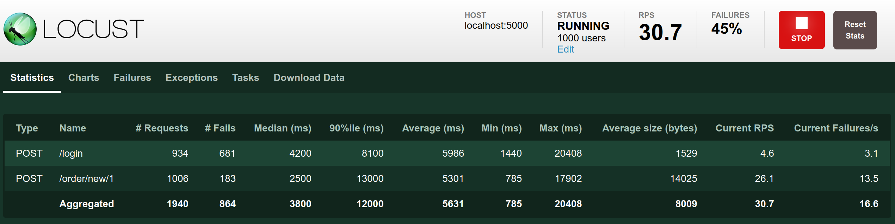

After the stress test was carried out for a period of time, the system was down, as shown in the figure:

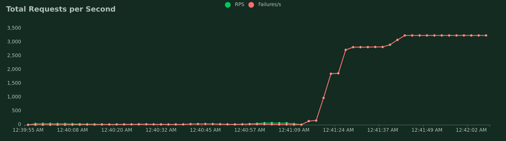

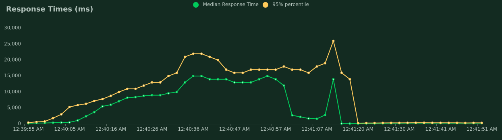

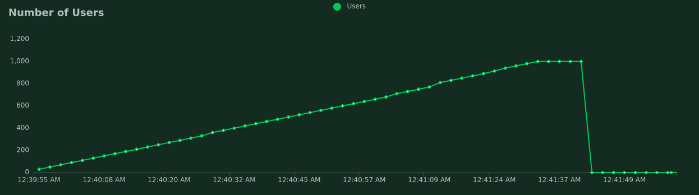

## Test 2 

10 users initiate orders at the same time.

```
locust -f test_orders.py
```

Number of users (peak concurrency): `10`

Spawn rate (users added/stopped per second): `1`

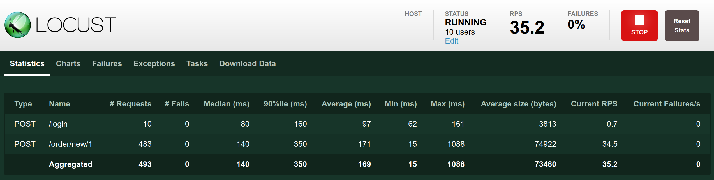

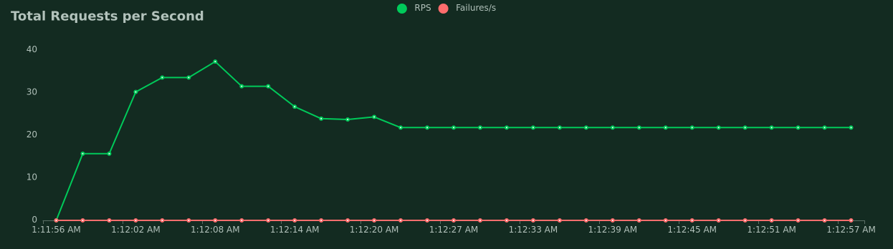

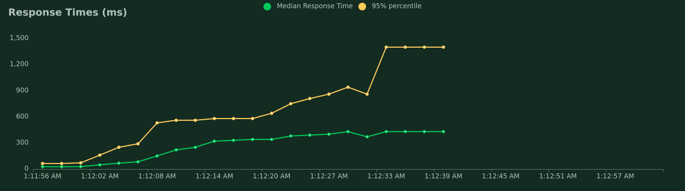

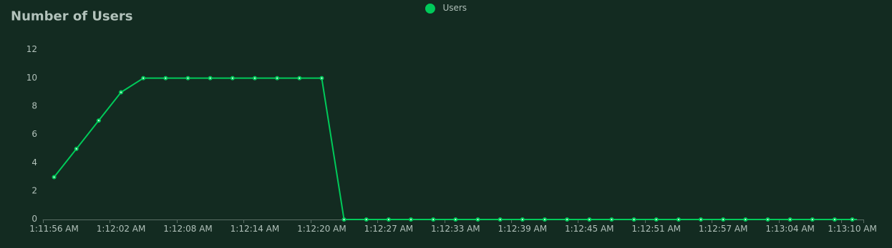

## Test 3

100 users initiate orders at the same time.

```
locust -f test_orders.py
```

Number of users (peak concurrency): `100`

Spawn rate (users added/stopped per second): `100`

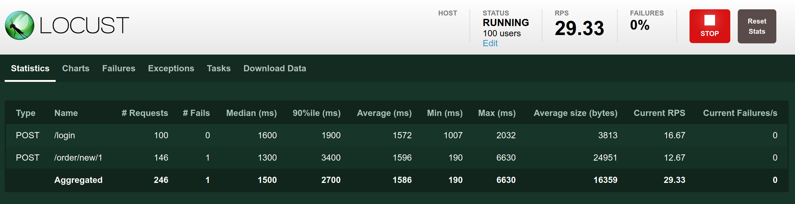

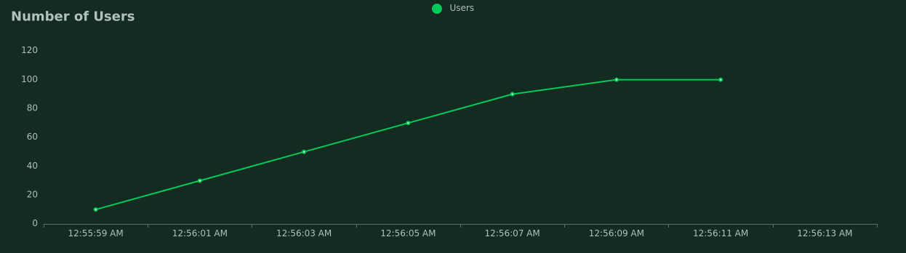

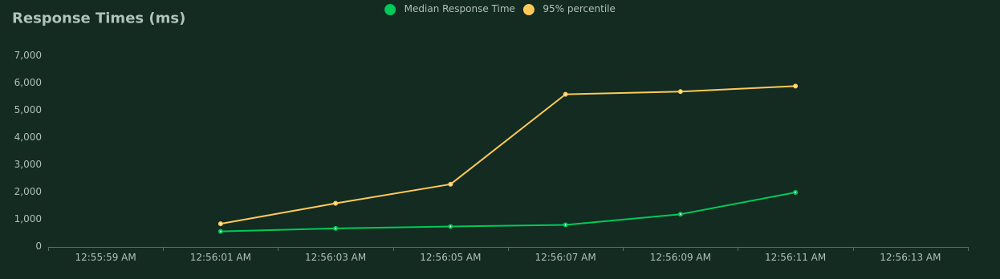

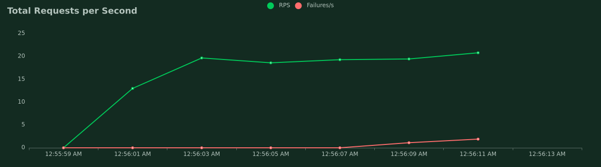

## Test 4

Initial system load (application is not running):

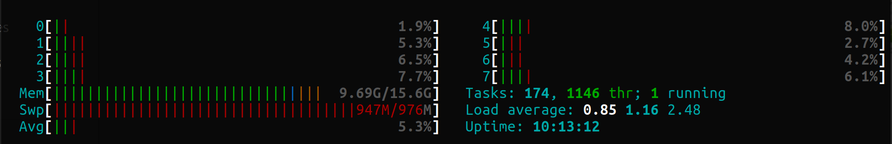

10 users operating simultaneously:

Terminal 1:

```
locust -f test_orders.py --master
```

Terminal 2、3、4、5：

```
locust -f test_orders.py --worker --master-host=0.0.0.0
```

Number of users (peak concurrency): `100`

Spawn rate (users added/stopped per second): `10`

Result:

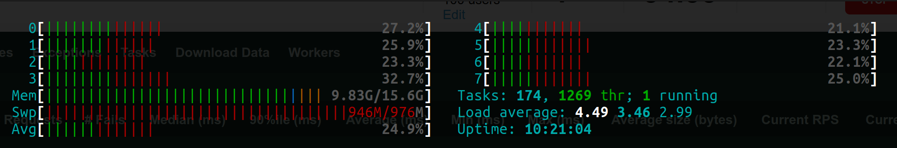

## Test 5

Initial system load (application is not running):

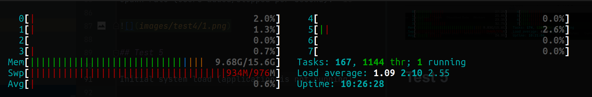

1000 users operating simultaneously:

Terminal 1:

```
locust -f test_orders.py --master
```

Terminal 2、3、4、5：

```
locust -f test_orders.py --worker --master-host=0.0.0.0
```

Number of users (peak concurrency): `1000`

Spawn rate (users added/stopped per second): `100`

Result:

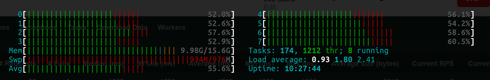

## Test 6


Initial system load (application is not running):

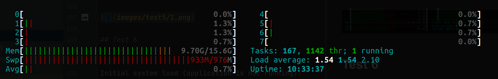

1000 users visiting index page:

Terminal 1:

```
locust -f test_system.py --master
```

Terminal 2、3、4、5：

```
locust -f test_system.py --worker --master-host=0.0.0.0
```

Number of users (peak concurrency): `1000`

Spawn rate (users added/stopped per second): `100`

Result:

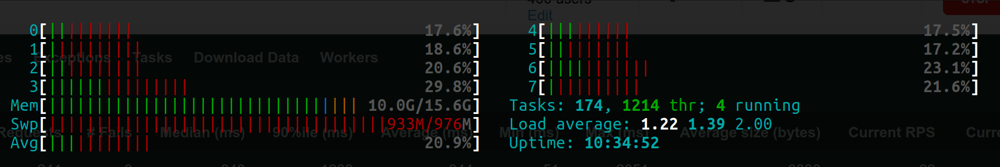

## Test 7

Initial system load (application is not running):

10000 users visiting index page:

Terminal 1:

```
locust -f test_system.py --master
```

Terminal 2、3、4、5：

```
locust -f test_system.py --worker --master-host=0.0.0.0
```

Number of users (peak concurrency): `10000`

Spawn rate (users added/stopped per second): `1000`

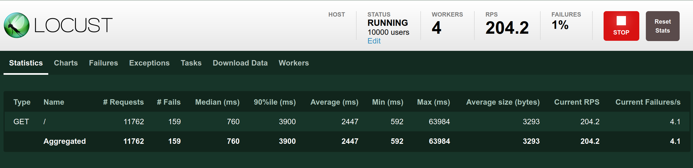

Result:

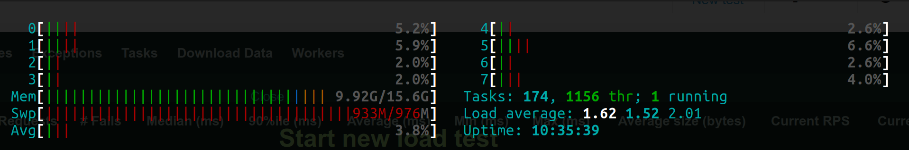

## Test 8

Based on risk: R9 - Poor code quality

Since the test coverage of code is one of the factors that infer the quality of the code, we conducted a coverage test:

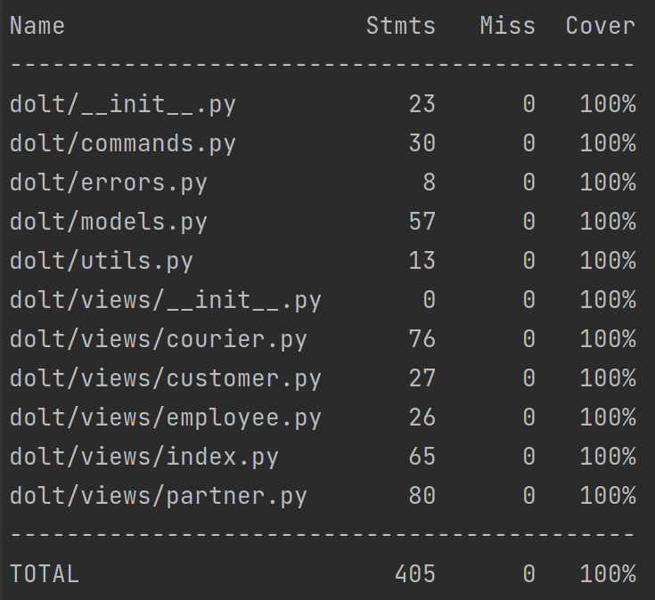
